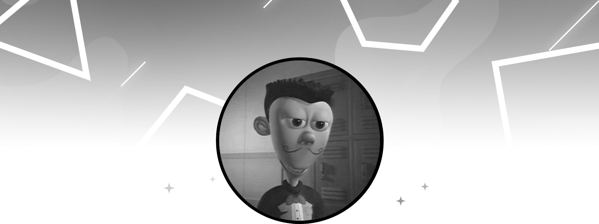

<!--Rainbow gif-->

  <!--Avatar-->
  

  

# _Olá, como vai?._ 

_Olá, meu nome é Erick Daniel e atualmente estou cursando Análise e Desenvolvimento de Sistemas na Universidade do Paraná (Unipar)._

_Esta conta GitHub serve como meu perfil secundário, criado especificamente para testar scripts e vários projetos à medida que me aprofundo no mundo da programação. Estou empenhado em aprimorar minhas habilidades e expandir meu conhecimento neste campo dinâmico._

##

<!--Discord-->
<h3>Discord</h3>

 <a href="https://discord.com/users/337384626949718020?">
  <!----></a>

<!--Spotify-->

<h3>Listening</h3>
  <a href="https://github.com/tthn0/Spotify-Readme">
  <picture>
    <source
      media="(prefers-color-scheme: light), (prefers-color-scheme: no-preference)"
      srcset="https://spotify-amber-kappa.vercel.app/api?theme=light&scan=true&rainbow=true" />
    <source
      media="(prefers-color-scheme: dark)"
      srcset="https://spotify-amber-kappa.vercel.app/api?theme=dark&scan=true&rainbow=true&spin=true" height="160" width="480"
    />
     <!-- https://github.com/tthn0/Spotify-Readme -->
  </picture>
  

</a>

 

## Life

:shipit: Minha Conta principal GitHub @ [**ErickDaniel7**][acc]  
:shipit: Estudante de Análise e desenvolvimento de sistemas na @ [**UNIPAR**][unv]  
:shipit: Residente em [**CascavelPR**][cvc]  

[acc]: https://github.com/ErickDaniel7/ErickDaniel7
[unv]: https://www.unipar.br/
[cvc]: https://www.viajeparana.com/Cascavel

## Skills

_Linguagem de programação favorita: Python :snake:._  
_Outras skills: :paintbrush: design gráfico, :video_game: jogos,
:soccer: futebol, :computer_mouse: experiências interativas._

## Software

## Links

 
  
 

<!--Code Cicle Emoji-->

  
**Code Cycle** 

&nbsp;&nbsp;&nbsp;&nbsp;&nbsp;

&nbsp;&nbsp;&nbsp;&nbsp;&nbsp;
 

###

<!--Gradient-->

  

<!--Rainbow Gif-->

